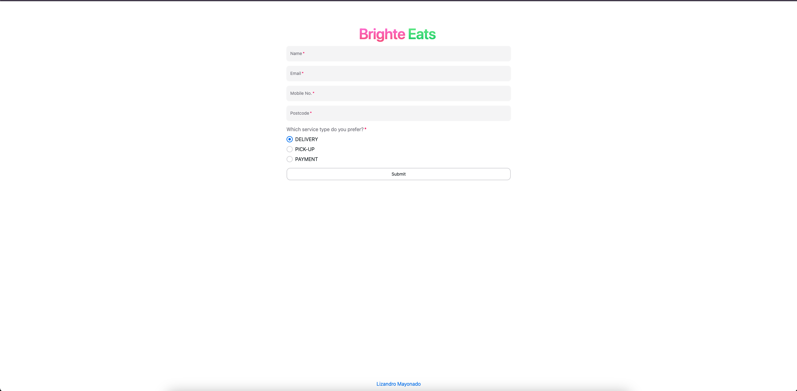
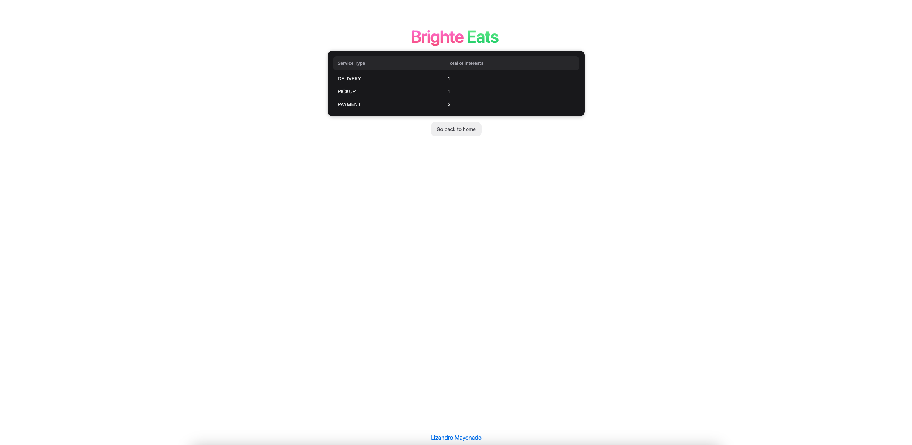

# Brighte Eats Frontend

## Routes

`http://localhost:4000` - Home Page



`http://localhost:4000/lead` - List of Service Type Page



## Setup Procedure

1. Install the dependencies by npm install in terminal

```bash
npm install
```

2. Make a copy of environment variables, and adjust accordingly to match local setup

```bash
cp .env.example .env
```

3. Then, run `npm run dev` to run it to your local server

**To run it on Docker.**

Make sure you have your Docker tools such as Docker Desktop, Rancher, etc. installed on your machine.

1. Dockerfile && docker-compose.yaml are already provided in this repository.
2. In terminal, run

```bash
docker compose up
```

3. Once, the command succeeds, Open your browser and navigate to `http://localhost:4000` and you should see something like this.

```bash
 ✔ Container brighte-eats-brighte-eats-1  Created
Attaching to brighte-eats-1
brighte-eats-1  |    ▲ Next.js 15.0.4
brighte-eats-1  |    - Local:        http://localhost:4000
brighte-eats-1  |
brighte-eats-1  |  ✓ Starting...
brighte-eats-1  |  ✓ Ready in 338ms
```
